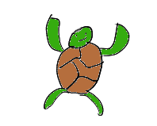

# SLogo

This project implements a development environment that helps users write
programs to draw using a turtle.

Names: Oliver Rodas, Joshua Petitma, Jiyang Tang, Martha Aboagye

### Timeline

Start Date: March 8

Finish Date: March 22

`git estimate` times.

These aren't very accurate but do give a general outline of how much time we
spent on this.

What isn't included is the fact that we spent a lot of time pair programming

commits by jt304@duke.edu === 10.82 days (86.52 hours)

commits by martha.aboagye@duke.edu === 0.25 days (2.00 hours)

commits by oliver.rodas@duke.edu === 16.94 days (135.54 hours)

commits by mfa23@duke.edu === 8.71 days (69.70 hours)

commits by joshuapetitma@yahoo.com === 21.06 days (168.51 hours)

### Primary Roles

Oliver Rodas - Designing the parser, command structure and execution, execution
environment, and interface with the view.

Josh - Designing communication system between View and Model.  Designing view's
structure and the coordinate method for turtle movement.  Also created the
beautiful logo :D.

Martha Aboagye - Organizer, designed settings and command panes. Creating
translations and managing all resources/resource fetching for the view. Created
test for view functionalities

Jiyang - Helped create backend infastructure. Primarily designed structure fo
AST evaluation and created all the ASTNodes.

### Resources Used

Java Documentation, StackOverflow, JFoenix - UI library.

### Running the Program

Main class: Main.java

Data files needed: Resource bundles for exceptions, commands in a specific
language, and UI fields in a language.

Features implemented:

*   Multiple turtles - Set the main turtle by shift clicking recursion
*   all specified commands
*   multiple workspaces
*   saving and loading workspaces
*   grouping of commands
*   running commands from files
*   animations
*   setable image for a turtle
*   themes
*   Autosave and Autoload workspaces (numerical).
* 	Change pen thiccness
*		Run commands from view
*		Toggle active turtle
*		Edit variables from view

Everything besides the color pallete for the turtle pen. and moving the turle from
the view.

Extra:

*   User Experience things like pressing the up button to get the last command
*   Animations. Cuz they're cute.
*   Add extra turtles. Click to select turtle command affects
*   Move the sandbox around by clicking and dragging
*   Zoom in and out by using mouse wheel inside sandbox
*   Recenter sandbox by clicking
*   "center" Shift + Enter to execute commands.
*   Save Image drawn by clicking
*   "Save Image"
*   AutoSaving and AutoReloading
*   Commands scroll as you rerun them in the history 
*   Turtle Nametags!!!
*   Set individual turtles names by right
*   clicking and selecting "Set Name" 
*   Set individual turtles pen color by right
*   clicking and selecting "Set Pen" 
*   Set individual turtle images by right
*   clicking and selecting "Set image"

### Notes/Assumptions

Assumptions or Simplifications:

*   No color pallette for turtles, all turtles colors must be set manually

Interesting data files:

*   look at /data/images/human.png

Known Bugs:

*   Sometimes when adding turtles from the GUI it will add an extra turtle

Extra credit:

*   look at /data/images/human.png

*   Also look at underneath "Features implemented"

### Impressions

Josh:

I really enjoyed working on this project! I eventually got really exhausted
working with Java however.  This was probably the best teamwork experience I've
ever had in my life. Everyone was hardworking, wanted to help each other,
organized, responsive literally couldn't have had a better experience. Toward
the end I started getting a bit tired of coding in java for some reason and
didn't really want to work on it the last day, but I got s udden gust of energy
and was able to implement the workspaces feature at the end. I feel like this
was a great opportunity for me to learn how to work collaboratively and learn
how to get everyone involed in a project. As I go onto yhe next project I hope
to pace myself much better so I don't end up needlessly burning myself out by
the end of each week.

Oliver: 

I really enjoyed this project. This was a good team working experience and everyone was very enthusiastic and open to new ideas. The problem solving aspect of this project was very fun. Overall an enjoyable and good project to apply our knowledge or course concepts.